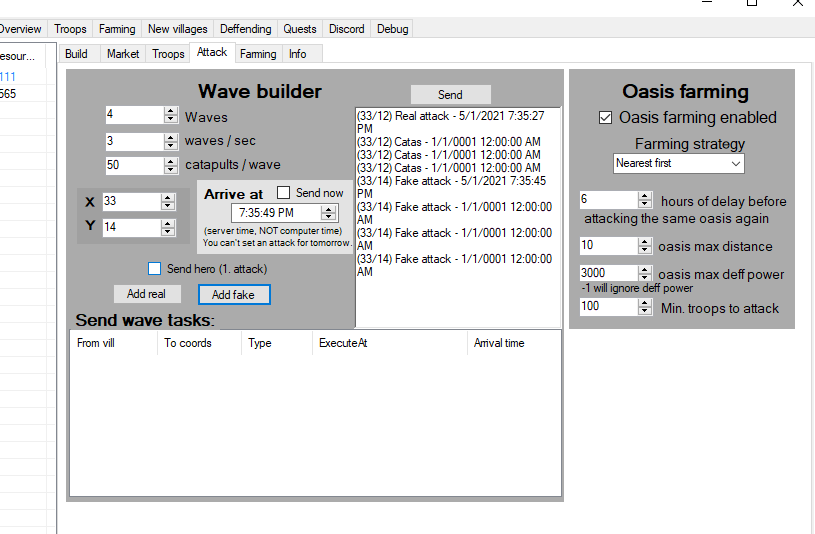
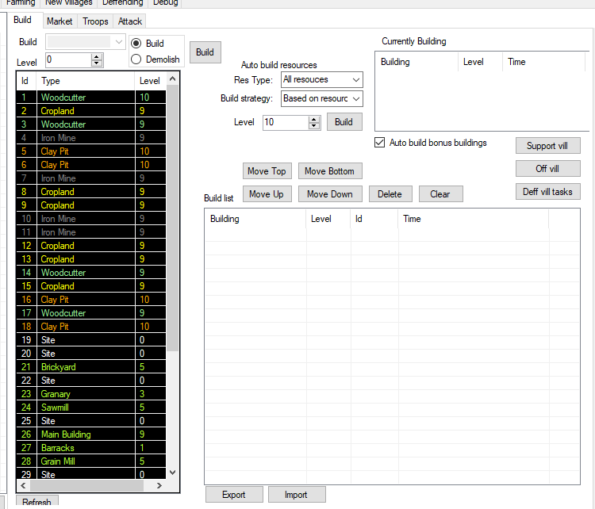
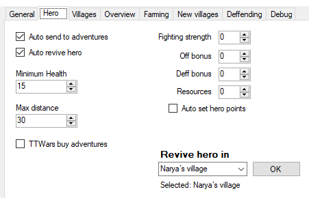
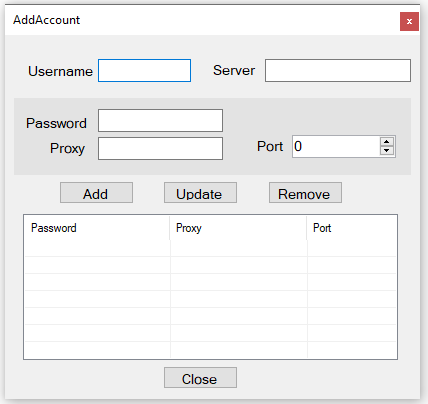
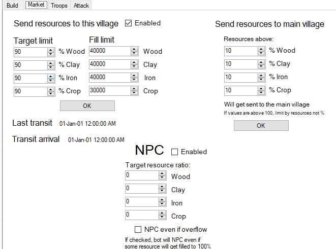
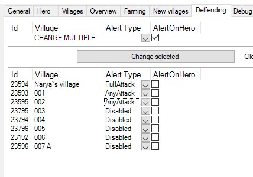

# TravianBotSharp (TBS)
#### [DOWNLOAD COMPILED BOT HERE](https://drive.google.com/drive/folders/1db_wPZeg5w7BQs5ROa29x2LGDxCzoXIj?usp=sharing)

#### About
I have worked on this bot for over 2 years, ~15k LoC. It was mainly tested and developed for [TTWars server](https://ttwars.com), so there are many features specific for that server. I have tested it on T4.5 and did some bugfixes, it seems to work now. I'm not sure if I will develop it any further since I don't play this game anymore.

## Features
#### - Auto-Change proxy
TBS can change proxy by itself.  This means you are far less likely to be banned for using a bot. Main reason for a bot ban is high activity from same IP (12h+).
#### - Auto-Settle new villages
TBS can find appropriate valleys to settle around your capital village. Or you can input coordinates in advance and it will automatically settle one valley after another.
#### - Auto-Fill troops and send resources to/from capital
TBS will automatically send resources from capital village to deff villages, train troops there and send the remaining resources back. This is a perfect feature for any deff account.
#### - Attack/Fake at specific time with multiple waves
Dream-come-true for any offensive player.

#### - Building

#### - Farming

#### - Send hero to adventures

#### - Multiple accounts, proxy options

#### - Auto NPC when crop is above 99%
#### - Send resources to new villages

#### - Alert on attack

#### Tech specification
It's a Windows Forms app written in C#. It only works on Windows. I had a plan to make a web app for the frontend and I have already ported the TBS Core to the .Net Standard, so it could be used by .Net core project (cross-platform option).