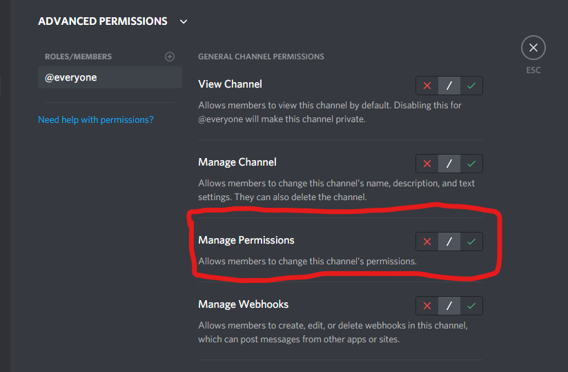
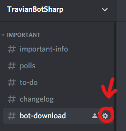
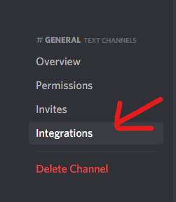
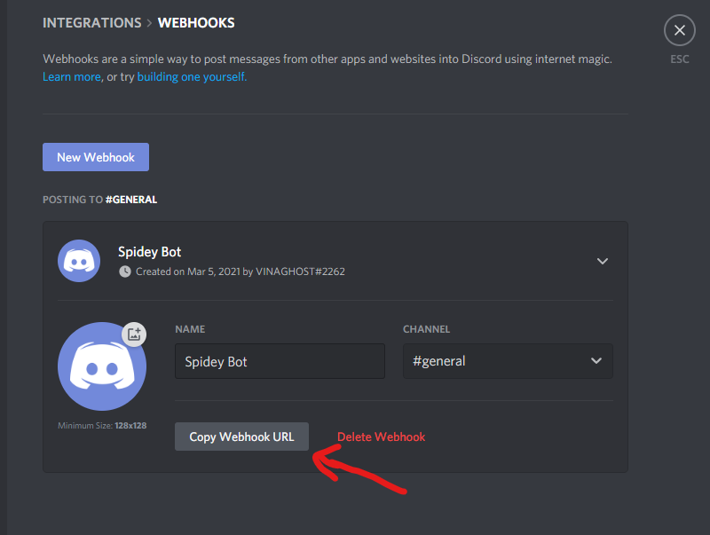
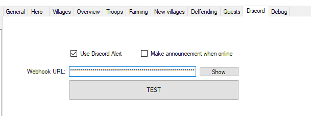
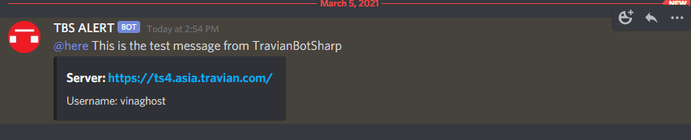

# Discord alert through webhook url

## Description

TBS will send ping @here through webhook to your Discord server's channel.

## Prerequisite

Permission "Manage Webhooks"

## Usage

### Step 1 - Get Webhook url

Choose your channel you want to receive message from TBS and click Edit Channel.

Go to Integrations

Choose "Create Webhook"

Change name and avatar you want for your webhook after that press "Copy Webhook URL"

### Step 2 - Give bot your Webhook url

Go to tab Discord and tick "Use Discord Alert"

Paste your Webhook url to "Webhook URL:"

Press TEST to check your URL and this will save your URL to your **ACCOUNT** (you need to do this again with other account)

